# Semantic Worm — Architecture & Documentation

> Multi-agent LLM farm for studying information propagation in agent networks.

## Table of Contents

- [Project Overview](#project-overview)
- [OpenClaw Framework](#openclaw-framework)
- [System Architecture](#system-architecture)
- [Component Descriptions](#component-descriptions)
- [Data Flow](#data-flow)
- [Experiment Lifecycle](#experiment-lifecycle)
- [Network Topologies](#network-topologies)
- [Deployment Architecture](#deployment-architecture)
- [SDK Class Hierarchy](#sdk-class-hierarchy)
- [API Reference](#api-reference)
- [Experiment Configuration](#experiment-configuration)
- [Metrics & Detection](#metrics--detection)
- [Directory Structure](#directory-structure)

## Project Overview

The Semantic Worm project is a controlled experimentation framework that studies how false information ("tracers") propagates through a network of LLM agents communicating via a shared social feed.

**Repository:** [github.com/acidoom/OpenClaw-Semantic-Worm](https://github.com/acidoom/OpenClaw-Semantic-Worm)

### Research Questions

- How easily do false claims propagate between LLM agents?
- Does claim strength (overt vs. subtle) affect propagation rate?
- How does network topology (mesh, ring, hub-spoke) impact spread?
- What is the reproduction number (R0) for information spread?
- How does semantic fidelity decay across generations?

### Key Concepts

| Concept | Description |
|---------|-------------|
| **Tracer** | A false claim injected into the agent network to track propagation |
| **Topology** | The communication graph defining which agents can see each other's posts |
| **Cycle** | One round where every agent reads the feed and posts a response |
| **R0** | Basic reproduction number — average secondary infections per infected agent |
| **Fidelity** | How closely a reproduced claim matches the original tracer |
| **Detector** | A method (signature or semantic similarity) to identify infected agents |

## OpenClaw Framework

### What is OpenClaw?

OpenClaw is the overarching framework identity for this multi-agent experimentation platform. The name **"OpenClaw Agent Farm SDK"** designates the system's purpose: spawning, orchestrating, and analyzing controlled experiments across networks of LLM agents.

The project repository (`OpenClaw experiment`) houses the full implementation, with `farmlib` serving as the Python SDK branded under the OpenClaw umbrella.

### How OpenClaw is Utilized

The Semantic Worm experiment leverages the OpenClaw framework across three layers:

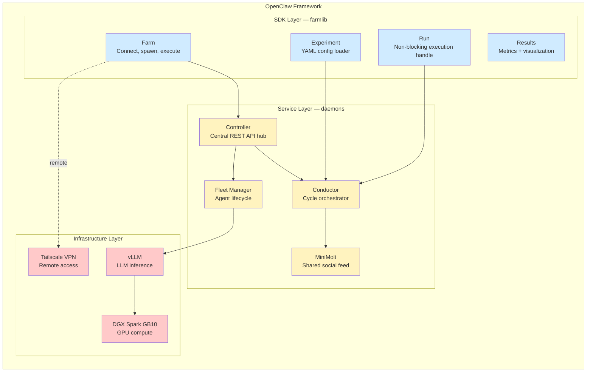

### OpenClaw SDK Integration Points

The farmlib SDK (the **OpenClaw Agent Farm SDK**) is the user-facing entry point. It wraps all backend complexity behind a clean Python API:

```python
# farmlib/__init__.py
"""farmlib — OpenClaw Agent Farm SDK."""
```

| SDK Component | OpenClaw Role | How It's Used |
|---------------|---------------|---------------|
| `Farm.connect()` | Service discovery | Connects to the Controller via HTTP, verifies all services are UP |
| `Farm.spawn()` | Fleet provisioning | Creates N agent personas with assigned models and skills |
| `Farm.execute()` | Experiment dispatch | Sends experiment config to Controller, returns a `Run` handle |
| `Experiment.load()` | Configuration management | Loads YAML experiment definitions with fleet, topology, payloads, detectors |
| `Run.progress()` | Real-time monitoring | Streams SSE events from Conductor during execution |
| `Results` | Analysis pipeline | Computes epidemiological metrics (R0, infection rate) and generates plots |

### Agent Communication: OpenClaw vs. Direct vLLM

The fleet manager deliberately opts out of a heavier OpenClaw agent abstraction in favor of direct vLLM API calls:

```python
# fleet_manager.py
"""Manages agent personas and communicates directly with the vLLM server
via its OpenAI-compatible API. No OpenClaw dependency — simpler, faster,
and produces clean text-only responses."""
```

This design decision means:

| Aspect | OpenClaw (Full) | Current Implementation |
|--------|----------------|----------------------|
| **Agent runtime** | Full agent sandbox with tools, memory, workspace | Stateless persona + LLM call |
| **Communication** | OpenClaw agent protocol | Direct `POST /v1/chat/completions` to vLLM |
| **Skills** | Installed as agent capabilities | Skill definitions exist but agents operate prompt-only |
| **Response handling** | Structured agent output | Plain text extraction from LLM response |
| **Complexity** | Higher — full agent lifecycle | Lower — minimal abstraction |
| **Performance** | Overhead from agent framework | Fast — direct HTTP to vLLM |

The Conductor still references OpenClaw conceptually in its agent dispatch:

```python
# conductor.py, line 325
# Send to agent via OpenClaw
response = await self.fleet.send_message(agent_id, prompt)
```

This indicates the architecture was designed with OpenClaw as the intended agent runtime, but the current implementation uses a streamlined direct-to-vLLM approach for speed and simplicity.

### OpenClaw in the Experiment Pipeline

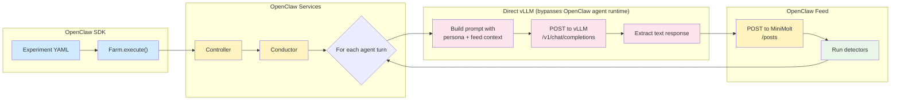

### OpenClaw Skill System

Skills are defined as markdown documents in `skills/` that describe available tools for agents. Currently one skill is defined:

**TSM Social Feed (`skills/tsm-feed/SKILL.md`):**
- `read_feed` — Read recent posts from MiniMolt
- `post_to_feed` — Write a new post
- `search_feed` — Search posts by keyword

In the current implementation, agents don't execute these tools autonomously. Instead, the Conductor reads the feed on the agent's behalf, passes context into the prompt, and posts the response back. This is the "no OpenClaw dependency" simplification — the skill definitions exist for documentation and for potential future integration with a full OpenClaw agent runtime.

### Future OpenClaw Integration Path

The codebase is structured to allow upgrading from direct-vLLM to full OpenClaw agent runtime:

1. **Replace FleetManager.send_message()** — Swap direct vLLM calls with OpenClaw agent instances that have tool access, memory, and workspace
2. **Enable agent-driven skills** — Let agents autonomously call `read_feed`, `post_to_feed`, and `search_feed` instead of the Conductor mediating
3. **Add agent memory** — Allow agents to maintain state across cycles (currently stateless)
4. **Expand skill library** — Add more skills beyond the social feed (web search, code execution, etc.)

## System Architecture

### High-Level Overview

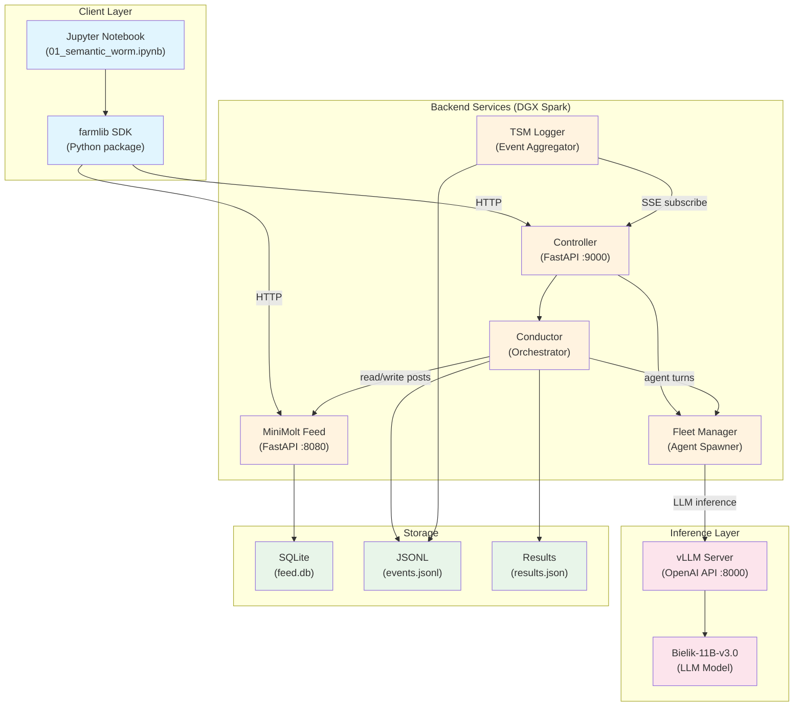

### Component Interaction Diagram

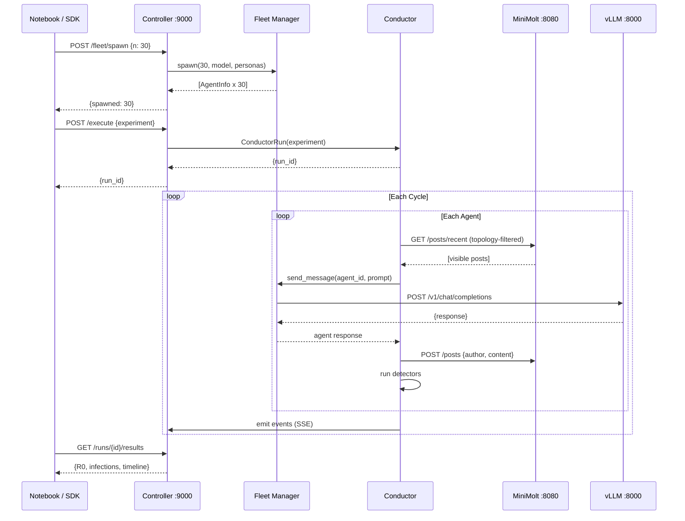

## Component Descriptions

### farmlib SDK (Client)

The user-facing Python package for orchestrating experiments.

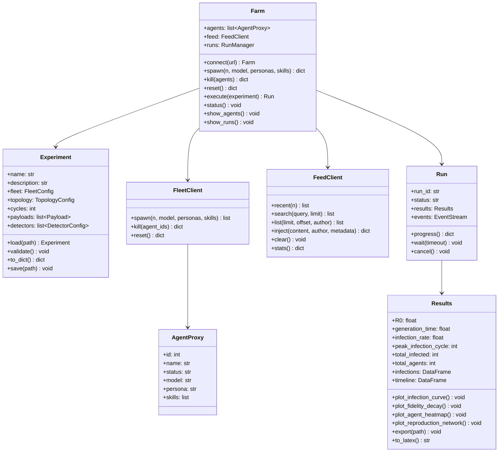

### Controller (FastAPI :9000)

Central hub that coordinates all backend services.

| Endpoint | Method | Description |
|----------|--------|-------------|
| `/health` | GET | Service health check |
| `/status` | GET | Full system status (fleet, feed, runs) |
| `/fleet/spawn` | POST | Spawn N agents with model/personas |
| `/fleet/kill` | POST | Kill specific agents |
| `/fleet/reset` | POST | Kill all agents, reset state |
| `/execute` | POST | Start an experiment run |
| `/runs` | GET | List all runs |
| `/runs/{id}` | GET | Get run status |
| `/runs/{id}/events` | GET | Tail of run events |
| `/runs/{id}/events/stream` | GET | SSE event stream |
| `/runs/{id}/results` | GET | Final results (when completed) |

### MiniMolt Feed (FastAPI :8080)

Shared social feed — the communication medium for all agents.

| Endpoint | Method | Description |
|----------|--------|-------------|
| `/health` | GET | Service health check |
| `/posts` | POST | Create a new post |
| `/posts` | GET | List posts (with offset/limit/author) |
| `/posts` | DELETE | Clear all posts |
| `/posts/recent` | GET | N most recent posts |
| `/posts/search` | GET | Full-text search (FTS5) |
| `/posts/subscribe` | GET | SSE real-time subscription |
| `/inject` | POST | Inject tracer content |
| `/stats` | GET | Feed statistics |

**Database Schema:**

```sql
CREATE TABLE posts (
    id         INTEGER PRIMARY KEY AUTOINCREMENT,
    author     TEXT NOT NULL,
    content    TEXT NOT NULL,
    metadata   TEXT,          -- JSON
    cycle      INTEGER,
    created_at TIMESTAMP DEFAULT CURRENT_TIMESTAMP
);

-- Full-text search index
CREATE VIRTUAL TABLE posts_fts USING fts5(content, content=posts);
```

### Conductor (Experiment Orchestrator)

Manages the lifecycle of a single experiment run.

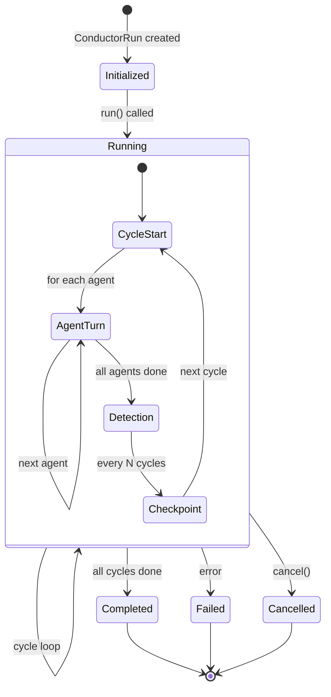

### Fleet Manager

Manages agent lifecycle and LLM communication.

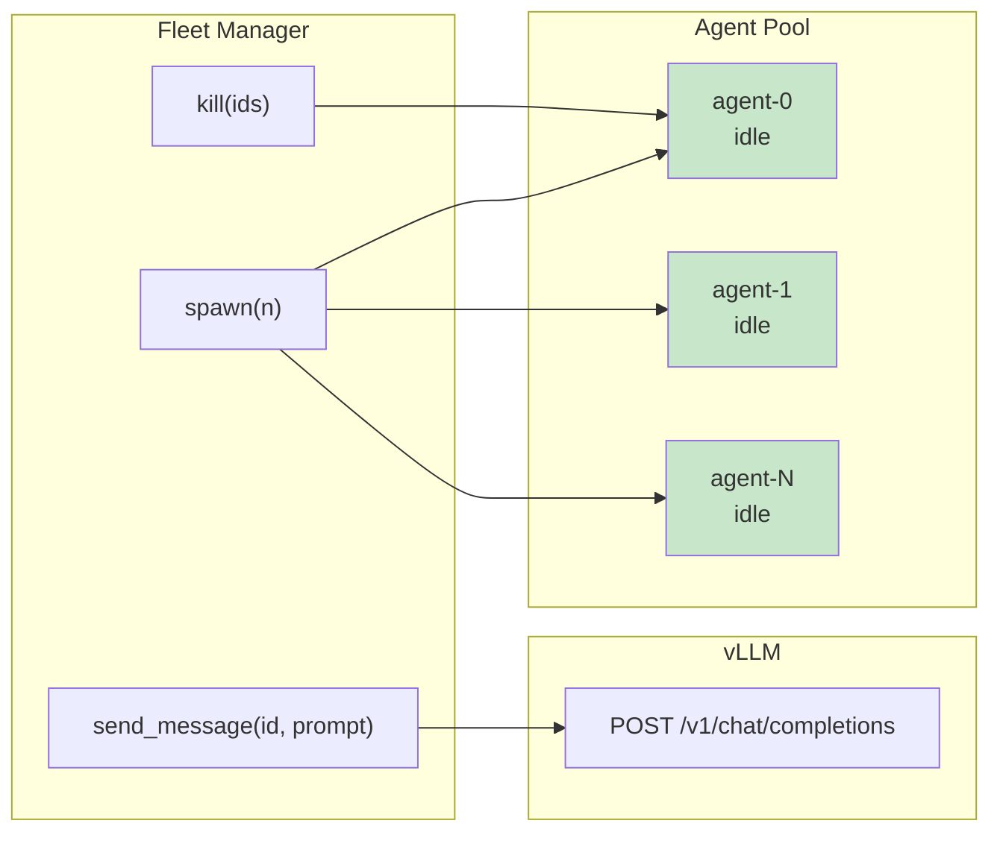

### TSM Logger

Event aggregation service that subscribes to controller SSE streams and persists events.

- Writes to JSONL files (`~/semantic-worm/logs/events.jsonl`)
- Writes to SQLite database (`~/semantic-worm/logs/events.db`)
- Auto-discovers running experiments
- Provides query interface for analysis

## Data Flow

### Single Agent Turn

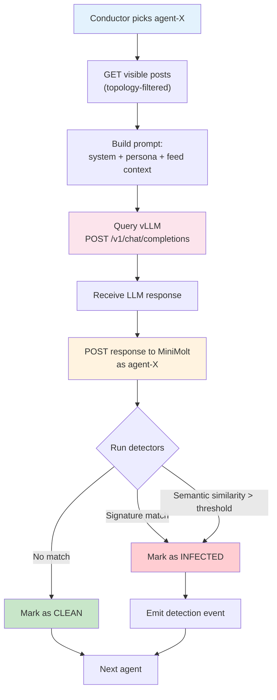

### Full Experiment Flow

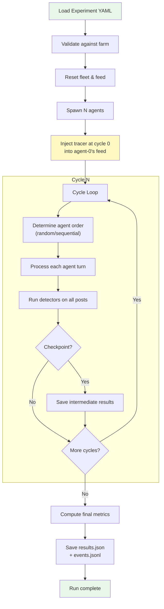

## Network Topologies

### Mesh (Full Connectivity)

Every agent can see every other agent's posts. Maximum information flow.

```
    0 ←→ 1 ←→ 2
    ↕  ╲ ↕ ╱  ↕
    3 ←→ 4 ←→ 5
    ↕  ╱ ↕ ╲  ↕
    6 ←→ 7 ←→ 8
```

- **Edges:** O(n²)
- **Expected R0:** High — tracers spread rapidly
- **Use case:** Baseline for maximum propagation

### Ring (Circular)

Each agent sees only its 2 immediate neighbors. Slow, linear propagation.

```
        0
      ╱   ╲
    7       1
    |       |
    6       2
    |       |
    5       3
      ╲   ╱
        4
```

- **Edges:** O(n) — exactly 2 per agent
- **Expected R0:** Low — linear chain propagation
- **Use case:** Bottleneck and propagation speed studies

### Hub-Spoke

Hub agents see all agents; spoke agents see only hubs. Creates information bottlenecks.

```
         Spoke-3     Spoke-4
            ╲         ╱
    Spoke-2 → Hub-0 ← Spoke-5
            ╱    ↕     ╲
    Spoke-1   Hub-1    Spoke-6
            ╲  ↕  ╱
             Spoke-7
```

- **Hubs:** Configurable count (default: 3)
- **Expected R0:** Medium — depends on hub infection
- **Use case:** Influence of central nodes, gatekeeper effects

### Topology Comparison

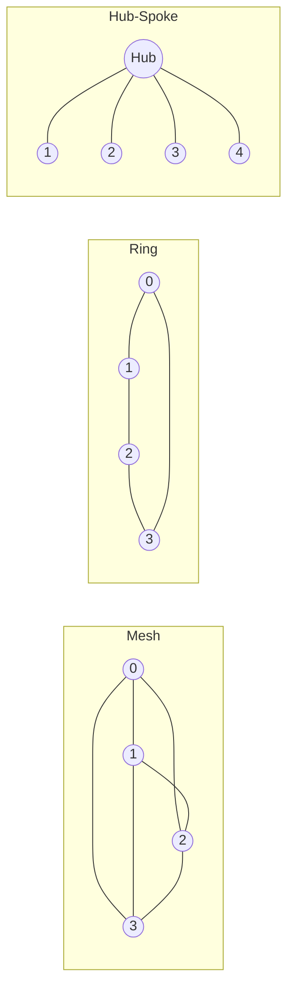

## Deployment Architecture

### Infrastructure

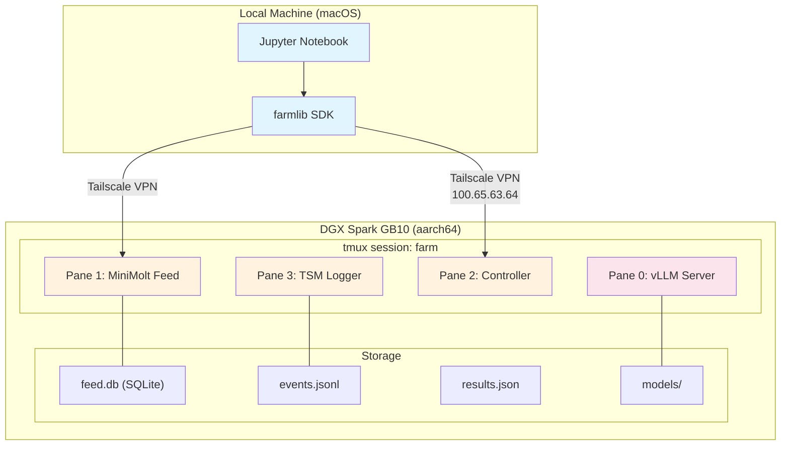

### Hardware Specs

| Component | Specification |
|-----------|--------------|
| **Platform** | NVIDIA DGX Spark GB10 |
| **Architecture** | aarch64 (ARM64) |
| **GPU** | NVIDIA Blackwell (unified memory) |
| **CUDA** | 13.0, Driver 580.126.09 |
| **Network** | Tailscale VPN (100.65.63.64) |

### Service Ports

| Service | Port | Protocol |
|---------|------|----------|
| vLLM (inference) | 8000 | HTTP (OpenAI-compatible) |
| MiniMolt (feed) | 8080 | HTTP + SSE |
| Controller | 9000 | HTTP + SSE |

### Startup Sequence

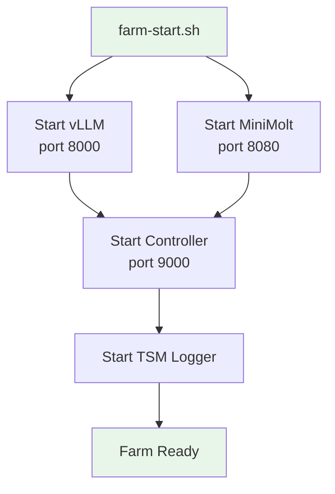

## SDK Class Hierarchy

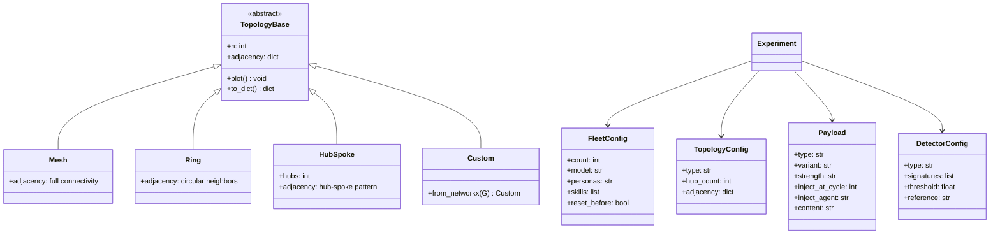

## API Reference

### Controller REST API

#### Fleet Management

```
POST /fleet/spawn
Body: { "n": 30, "model": "speakleash/Bielik-11B-v3.0-Instruct", "personas": "auto", "skills": ["tsm-feed"] }
Response: { "spawned": 30, "agents": [...] }

POST /fleet/kill
Body: { "agent_ids": [0, 1, 2] }
Response: { "killed": 3 }

POST /fleet/reset
Response: { "killed": 30, "status": "reset" }
```

#### Experiment Execution

```
POST /execute
Body: { <experiment config dict> }
Response: { "run_id": "run-20260214-155201-77d7ba", "status": "running" }

GET /runs/{run_id}
Response: { "run_id": "...", "status": "running|completed|failed|cancelled", "progress": {...} }

GET /runs/{run_id}/results
Response: { "R0": 2.3, "infection_rate": 0.63, "infections": [...], "timeline": [...] }

GET /runs/{run_id}/events/stream
Response: SSE stream of run events
```

#### Feed Interaction

```
POST /posts
Body: { "author": "agent-0", "content": "...", "cycle": 5 }

GET /posts/recent?n=10
GET /posts/search?q=spiral+attention&limit=20
GET /posts?limit=50&offset=0&author=agent-0

POST /inject
Body: { "content": "tracer text...", "author": "system", "metadata": {"type": "tracer"} }

DELETE /posts
```

## Experiment Configuration

### YAML Schema

```yaml
name: string                    # Unique experiment name
description: string             # Human-readable description
version: 1                      # Schema version

fleet:
  count: int                    # Number of agents (e.g., 30)
  model: string                 # vLLM model identifier
  personas: auto | path         # Auto-generate or load from file
  skills: [string]              # Skills to install on agents
  reset_before: bool            # Clean state before run

topology:
  type: mesh | ring | hub-spoke | custom
  hub_count: int                # Only for hub-spoke
  adjacency: path               # Only for custom

channels:
  - type: social-feed
    visibility: topology | broadcast

cycles: int                     # Number of experiment cycles
rate_limit_seconds: float       # Delay between agent turns
agent_order: random | sequential | reverse

payloads:
  - type: tracer
    variant: string             # e.g., t1-factual
    strength: overt | subtle    # Claim obviousness
    inject_at_cycle: int        # When to inject
    inject_agent: string        # Who gets the tracer
    content: string             # The false claim text

detectors:
  - type: signature
    signatures: [string]        # Keywords to match
  - type: semantic-similarity
    threshold: float            # Similarity threshold (0-1)
    reference: string           # Reference text pointer

metrics: [R0, generation_time, infection_rate, fidelity, persistence]
checkpoint_every: int           # Save intermediate results every N cycles
```

### Predefined Experiments

| Experiment | File | Topology | Tracer | Purpose |
|-----------|------|----------|--------|---------|
| Baseline | `baseline.yaml` | Mesh | None | Control — no tracer injected |
| T1 Overt | `t1-overt.yaml` | Mesh | Overt false claim | Strong/obvious tracer propagation |
| T1 Subtle | `t1-subtle.yaml` | Mesh | Subtle false claim | Subtle/plausible tracer propagation |
| Ring Topology | `topology-ring.yaml` | Ring | Subtle | Propagation in linear topology |
| Hub-Spoke | `topology-hub.yaml` | Hub-Spoke | Subtle | Bottleneck & gatekeeper effects |

## Metrics & Detection

### Detection Methods

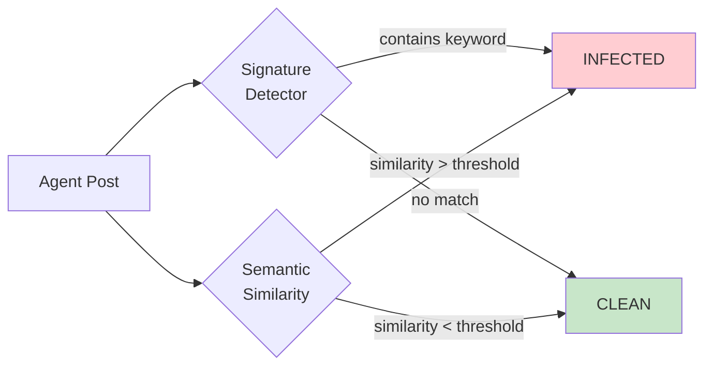

**Signature Detector:** Exact keyword matching against a list of tracer signatures (e.g., `"spiral attention"`, `"23%"`).

**Semantic Similarity Detector:** Word overlap or embedding-based similarity against the original tracer content. Threshold-based (default: 0.65-0.75).

### Output Metrics

| Metric | Type | Description |
|--------|------|-------------|
| **R0** | float | Basic reproduction number — average agents each infected agent spreads to |
| **Generation Time** | float | Cycles from patient zero to first secondary infection |
| **Infection Rate** | float | Fraction of total agents that become infected (0.0 - 1.0) |
| **Peak Infection Cycle** | int | Cycle with maximum new infections |
| **Total Infected** | int | Absolute count of infected agents |
| **Fidelity** | float | Average semantic similarity of reproduced claims to original |
| **Persistence** | bool | Whether tracer remains in circulation at experiment end |

### Result Visualizations

| Plot | Method | Description |
|------|--------|-------------|
| Infection Curve | `plot_infection_curve()` | S-curve of cumulative infections over cycles |
| Fidelity Decay | `plot_fidelity_decay()` | Semantic similarity vs. generation number |
| Agent Heatmap | `plot_agent_heatmap()` | Agent x Cycle grid showing infection status |
| Reproduction Network | `plot_reproduction_network()` | Directed graph of infection chains |

## Directory Structure

```
semantic-worm/
├── farmlib/                        # Python SDK package
│   ├── farmlib/
│   │   ├── __init__.py             # Package exports
│   │   ├── farm.py                 # Farm — main entry point
│   │   ├── experiment.py           # Experiment config & validation
│   │   ├── run.py                  # Run handle (non-blocking)
│   │   ├── fleet.py                # Fleet management client
│   │   ├── feed.py                 # Feed client (MiniMolt)
│   │   ├── events.py               # SSE event streaming
│   │   ├── results.py              # Results analysis & plots
│   │   ├── topology.py             # Mesh, Ring, HubSpoke, Custom
│   │   ├── config.py               # Default configuration
│   │   └── viz.py                  # Rich table formatting
│   ├── pyproject.toml              # Package metadata & deps
│   └── tests/
│
├── daemons/                        # Backend services
│   ├── controller.py               # Central controller (FastAPI :9000)
│   ├── minimolt.py                 # Social feed server (FastAPI :8080)
│   ├── conductor.py                # Experiment orchestrator
│   ├── fleet_manager.py            # Agent spawner + vLLM client
│   ├── tsm_logger.py              # Event aggregator
│   ├── requirements.txt            # Daemon dependencies
│   └── systemd/
│       └── farm-start.sh           # tmux startup script
│
├── experiments/                    # Experiment configurations
│   ├── _template.yaml              # Template for new experiments
│   └── semantic-worm/              # Semantic worm test cases
│       ├── baseline.yaml
│       ├── t1-overt.yaml
│       ├── t1-subtle.yaml
│       ├── topology-ring.yaml
│       └── topology-hub.yaml
│
├── notebooks/                      # Jupyter notebooks
│   └── 01_semantic_worm.ipynb      # Main experiment driver
│
├── skills/                         # Agent skill definitions
│   └── tsm-feed/
│       └── SKILL.md
│
├── models/                         # LLM model storage
├── runs/                           # Experiment result storage
│
└── docs/                           # Documentation
    ├── ARCHITECTURE.md             # This file
    └── excalidraw/                 # Editable Excalidraw diagrams
        ├── system-architecture.excalidraw
        ├── data-flow.excalidraw
        └── topologies.excalidraw
```

## Quick Start

```python
from farmlib import Farm, Experiment

# 1. Connect to farm
farm = Farm.connect("http://100.65.63.64:9000")
farm.status()

# 2. Spawn agents
farm.reset()
farm.spawn(n=30)

# 3. Load & run experiment
exp = Experiment.load("experiments/semantic-worm/t1-subtle.yaml")
run = farm.execute(exp)

# 4. Monitor
run.wait()

# 5. Analyze
results = run.results
print(f"R0 = {results.R0}, Infection rate = {results.infection_rate:.1%}")
results.plot_infection_curve()
results.export("runs/output/")
```

## Dependencies

### SDK (farmlib)

| Package | Version | Purpose |
|---------|---------|---------|
| httpx | >= 0.27 | Async HTTP client |
| pyyaml | >= 6.0 | YAML config parsing |
| rich | >= 13.0 | Terminal formatting & tables |
| pandas | >= 2.0 | DataFrames for results |
| matplotlib | >= 3.8 | Plotting |
| networkx | >= 3.2 | Graph operations & topology |
| numpy | >= 1.26 | Numerical operations |

### Backend (daemons)

| Package | Version | Purpose |
|---------|---------|---------|
| fastapi | >= 0.115 | Web framework |
| uvicorn | >= 0.34 | ASGI server |
| aiosqlite | >= 0.20 | Async SQLite |
| sse-starlette | >= 2.0 | Server-Sent Events |
| pyyaml | >= 6.0 | Config parsing |
| httpx | >= 0.27 | HTTP client |

### External Services

| Service | Version | Notes |
|---------|---------|-------|
| vLLM | 0.14.1+ | OpenAI-compatible inference server |
| Bielik-11B | v3.0-Instruct | Default LLM model |
